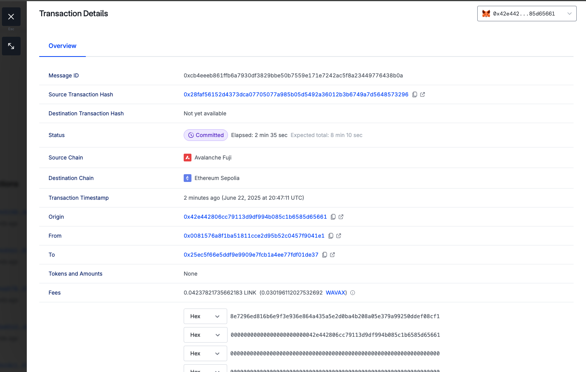

✅ Tic Tac Toe Demo deployed at address 0x6A00077dE2b56d8E488F765fea3Eee002DA202eb on ethereumSepolia blockchain
✅ Tic Tac Toe Demo deployed at address 0xe0440E65E840eFEfc185DBEe8f05D31985FdEd48 on avalancheFuji blockchain

❯ npx hardhat ttt-start --source-blockchain ethereumSepolia --sender 0x42e442806Cc79113D9Df994B085C1b6585d65661 --destination-blockchain avalancheFuji --receiver 0x42e442806Cc79113D9Df994B085C1b6585d65661
ℹ️ Attempting to send the message from the TTTDemo smart contract (0x42e442806Cc79113D9Df994B085C1b6585d65661) on the ethereumSepolia blockchain to the TTTDemo smart contract (0x42e442806Cc79113D9Df994B085C1b6585d65661 on the avalancheFuji blockchain)

✅ Message sent, game session created! transaction hash: 0x5fbb3ccdf8945c28c21306fc2ee58724be62605342d9ba6d7dbef6e6791f85b7

❯ npx hardhat ttt-check-winner --blockchain ethereumSepolia --contract 0x6A00077dE2b56d8E488F765fea3Eee002DA202eb --session-id 0x4c06fcc2e01fad4d40cf6985df88baea439f6c4dc14c729b72cfdc511f707681
ℹ️ Attempting to get details of sessionId 0x4c06fcc2e01fad4d40cf6985df88baea439f6c4dc14c729b72cfdc511f707681 from the TTTDemo smart contract (0x6A00077dE2b56d8E488F765fea3Eee002DA202eb) on the ethereumSepolia
winner of sessionId 0x4c06fcc2e01fad4d40cf6985df88baea439f6c4dc14c729b72cfdc511f707681 is: 0x0000000000000000000000000000000000000000
❯ npx hardhat ttt-check-winner --blockchain avalancheFuji --contract 0xe0440E65E840eFEfc185DBEe8f05D31985FdEd48 --session-id 0x4c06fcc2e01fad4d40cf6985df88baea439f6c4dc14c729b72cfdc511f707681
ℹ️ Attempting to get details of sessionId 0x4c06fcc2e01fad4d40cf6985df88baea439f6c4dc14c729b72cfdc511f707681 from the TTTDemo smart contract (0xe0440E65E840eFEfc185DBEe8f05D31985FdEd48) on the avalancheFuji
winner of sessionId 0x4c06fcc2e01fad4d40cf6985df88baea439f6c4dc14c729b72cfdc511f707681 is: 0x42e442806Cc79113D9Df994B085C1b6585d65661

https://testnet.snowtrace.io/address/0xe0440E65E840eFEfc185DBEe8f05D31985FdEd48/events

https://sepolia.etherscan.io/address/0x6A00077dE2b56d8E488F765fea3Eee002DA202eb

https://ccip.chain.link/status?networkType=testnet&search=sepo#/side-drawer/msg/0x421688c8ec701f0ec38b02f89ca5ba0ab451825992ed373ae881d95bb07e986d

---

new section with new contracts

✅ Tic Tac Toe Demo deployed at address 0x0081576a8F1ba51811ccE2d95B52C0457f9041E1 on avalancheFuji blockchain

✅ Tic Tac Toe Demo deployed at address 0x25Ec5F66e5DDF9e9909E7fcB1A4Ee77FDF01De37 on ethereumSepolia blockchain

second step is router update

npx hardhat ttt-update-router --blockchain ethereumSepolia --contract 0x25Ec5F66e5DDF9e9909E7fcB1A4Ee77FDF01De37 --router 0x0bf3de8c5d3e8a2b34d2beeb17abfcebaf363a59

ℹ️ Attempting to update contract 0x25Ec5F66e5DDF9e9909E7fcB1A4Ee77FDF01De37 router with addr 0x0bf3de8c5d3e8a2b34d2beeb17abfcebaf363a59
✅ Update successful, transaction hash: 0xa544c0c898ad015225e838260a117e200e4deea3a1f8f3b330aa7a541aaac821

npx hardhat ttt-update-router --blockchain avalancheFuji --contract 0x0081576a8F1ba51811ccE2d95B52C0457f9041E1 --router 0xf694e193200268f9a4868e4aa017a0118c9a8177

ℹ️ Attempting to update contract 0x0081576a8F1ba51811ccE2d95B52C0457f9041E1 router with addr 0xf694e193200268f9a4868e4aa017a0118c9a8177
✅ Update successful, transaction hash: 0x960f4fd347bf2a253ddf2b1601b67dabbd5a83ed68ba999e1fceec2a855aff6f

next step when we started a game with fuji client

